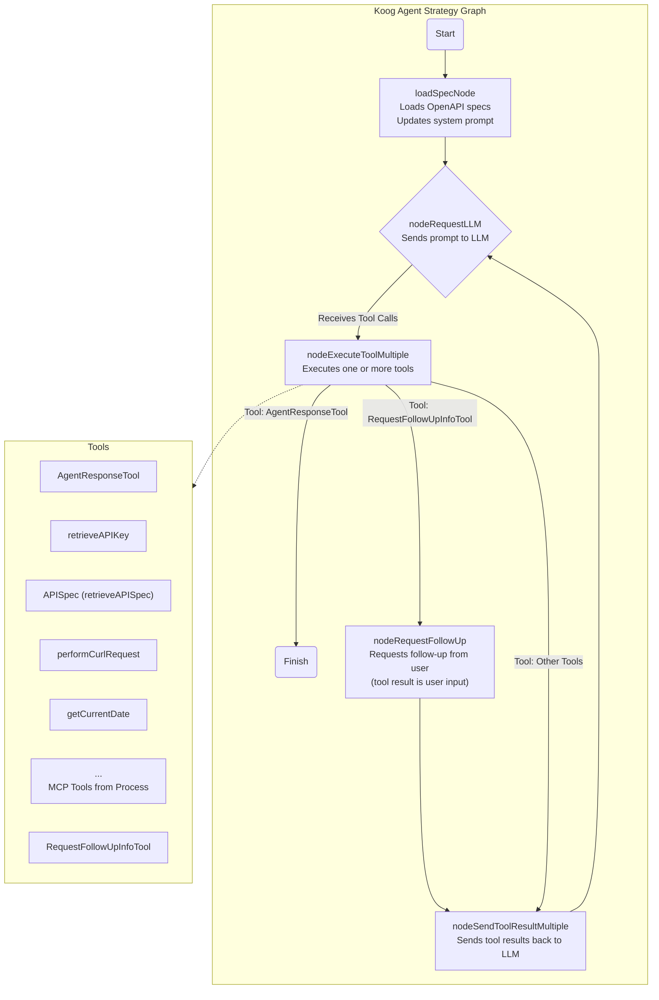

# Project Title: AI Spec Agent

## 1. Project Overview

This project is a command-line interface (CLI) application that utilizes AI agents to interact with OpenAPI specifications. It leverages the Koog framework for building AI agents and Clikt for creating a user-friendly CLI.

The project comes pre-configured with OpenAPI specifications for Quiver Quant, enabling users to query financial data. However, these specifications can be easily replaced or extended with any other OpenAPI-compliant API.

**Key Technologies:**

*   **Koog:** A framework for building sophisticated AI agents.
*   **Clikt:** A multiplatform command line interface parsing library.
*   **OpenAPI:** A standard for describing RESTful APIs.

## 2. Running the CLI

To run the AI Spec Agent, follow these steps:

1.  **Obtain API Keys:**
    *   **Quiver Quant:** Sign up for an API key at [https://www.quiverquant.com/](https://www.quiverquant.com/).
    *   **(Optional) Other APIs:** If you are using different OpenAPI specifications, obtain the necessary API keys from the respective providers.

2.  **Provide API Keys:**
    *   The agent can access necessary API keys using the `Retrieve API Key` tool, which is configured in the `ToolsRegistry`. To provide API keys for this tool, you can either:
        *   Directly add your API keys to the `keys` map within the `SpecAgent.kt` file.
        *   Modify the `retrieveAPIKey` function in `SpecAgent.kt` to read API keys from environment variables or another configuration source.

3.  **Provide OpenAPI Specifications:**
    *   Place your OpenAPI specification files (in JSON or YAML format) in the `specs/` directory.
    *   If your API specifications require API keys, ensure they are configured as described in step 2.

4.  **Run the Agent:**
    Execute the following command in your terminal:

    ```bash
    ./specagent --path specs/ --prompt '<your_prompt_here>'
    ```

    Replace `<your_prompt_here>` with your natural language query for the AI agent. For example:

    ```bash
    ./specagent --path specs/ --prompt 'What is the last trade that a senator made? What is the ticker symbol? And what is it currently trading at?'
    ```

## 3. ToolsRegistry

The ToolsRegistry in Koog is a central component responsible for managing and providing access to the various tools (functions or capabilities) that an AI agent can utilize. These tools can range from simple utility functions to complex integrations with external APIs or services.

In this project, the ToolsRegistry is configured with the following:

*   **Retrieve API Spec:** Retrieves detailed Open API data from app memory
*   **Retrieve API Key:** Retrieves API key for API spec
*   **Get Current Date:** Retrieves formatted current date
*   **Perform curl request:** Perform API request as curl
*   **Bright Data MCP Server:** MCP Server for public internet search
*   **Request Follow Up Info:** Requests additional information from the user.
*   **Agent Response Tool:** Send agent response to user

## 4. Agent Strategy

The Agent Strategy in Koog defines the high-level plan or logic that an AI agent follows to accomplish its goals. It dictates how the agent processes information, selects tools, and makes decisions. Different strategies can be implemented to cater to various tasks and complexities.

This project utilizes the following agent strategy:

*  ReAct Style Agent

**Workflow Diagram:**

